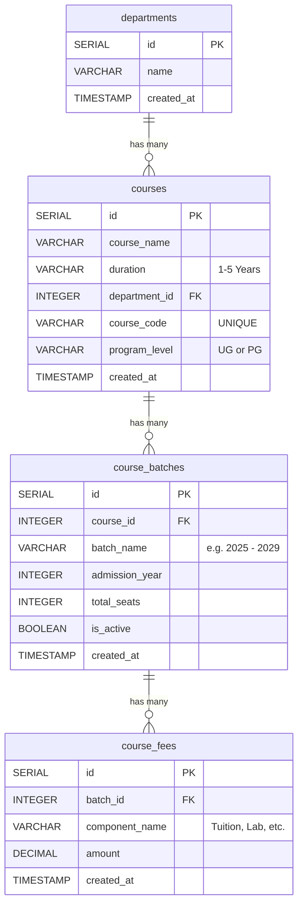
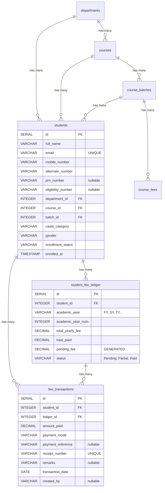
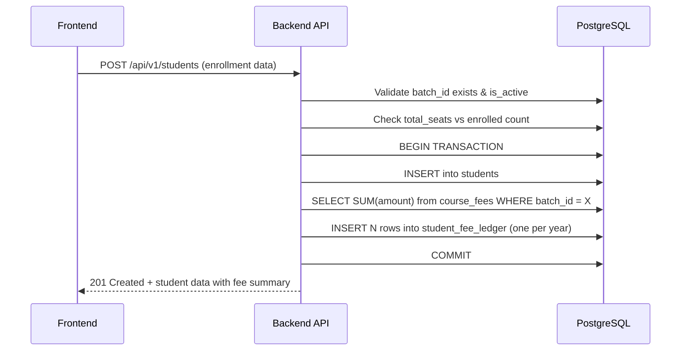
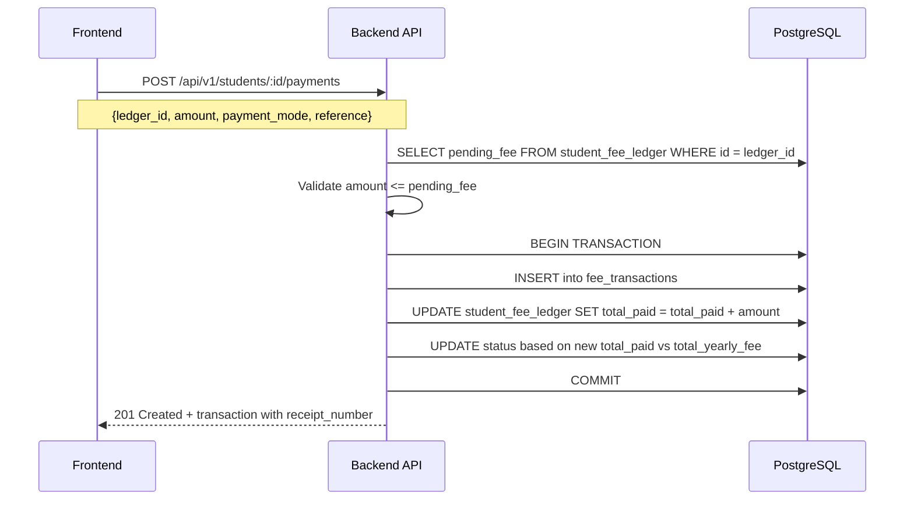

# 🎓 Student Enrollment & Fee Management — Master Plan

---

## 1. Existing Schema Analysis (Current State)

Here's what we already have and how each table relates:



### Key Observations

| Table | Purpose | Key Fields |
|---|---|---|
| `departments` | Academic departments (CSIT, MANAGEMENT) | `id`, `name` |
| `courses` | Course templates with code & duration | `course_name`, `duration` (1–5 Years), `course_code`, `program_level` (UG/PG) |
| `course_batches` | A specific intake/batch for a course | `course_id` → courses, `batch_name` (YYYY - YYYY), `admission_year`, `total_seats`, `is_active` |
| `course_fees` | Breakdown of fee components per batch | `batch_id` → course_batches, `component_name`, `amount` |

> [!IMPORTANT]
> The existing `students` table in `schema.sql` is a bare stub (just `id`, `name`, `email`). We'll **replace** it with a proper enrollment table.

---

## 2. New Tables Design

We need **3 new tables** (replacing the stub `students` table):

### Table A: `students` — The Enrollment Record

This is the core enrollment record created when an accountant enrolls a student.

```sql
CREATE TABLE IF NOT EXISTS students (
    id                  SERIAL PRIMARY KEY,
    full_name           VARCHAR(150) NOT NULL,
    email               VARCHAR(150) UNIQUE NOT NULL,
    mobile_number       VARCHAR(15) NOT NULL,
    alternate_number    VARCHAR(15) NOT NULL,
    prn_number          VARCHAR(50) DEFAULT NULL,      -- Optional, updated later
    eligibility_number  VARCHAR(50) DEFAULT NULL,      -- Optional, updated later
    department_id       INTEGER NOT NULL REFERENCES departments(id),
    course_id           INTEGER NOT NULL REFERENCES courses(id),
    batch_id            INTEGER NOT NULL REFERENCES course_batches(id),
    caste_category      VARCHAR(50) NOT NULL,           -- e.g. 'General', 'OBC', 'SC', 'ST', 'VJNT', 'SBC'
    gender              VARCHAR(10) NOT NULL CHECK (gender IN ('Male', 'Female', 'Other')),
    enrollment_status   VARCHAR(20) DEFAULT 'Active' CHECK (enrollment_status IN ('Active', 'Inactive', 'Graduated', 'Dropped')),
    enrolled_at         TIMESTAMP DEFAULT CURRENT_TIMESTAMP,
    updated_at          TIMESTAMP DEFAULT CURRENT_TIMESTAMP
);
```

**Why this design:**
- `department_id`, `course_id`, `batch_id` — All three FKs give us the complete enrollment context and let the FE pre-filter dropdowns (Department → Course → Batch cascade).
- `prn_number` & `eligibility_number` are **nullable** — these come later from the university.
- `enrollment_status` — tracks the student lifecycle.
- `caste_category` stored as VARCHAR (not FK) because categories are rarely modified and this avoids an extra join on every query.

---

### Table B: `student_fee_ledger` — Yearly Fee Snapshot

When a student is enrolled, we auto-create fee ledger rows — **one row per academic year**. This is the source of truth for "how much does this student owe this year."

```sql
CREATE TABLE IF NOT EXISTS student_fee_ledger (
    id                  SERIAL PRIMARY KEY,
    student_id          INTEGER NOT NULL REFERENCES students(id) ON DELETE CASCADE,
    academic_year       VARCHAR(20) NOT NULL,           -- e.g. 'FY', 'SY', 'TY', 'Final Year'
    academic_year_num   INTEGER NOT NULL,                -- 1, 2, 3, 4 (for sorting/logic)
    total_yearly_fee    DECIMAL(10,2) NOT NULL,          -- Total fee for this year (from course_fees SUM)
    total_paid          DECIMAL(10,2) DEFAULT 0.00,      -- Running total of payments
    pending_fee         DECIMAL(10,2) GENERATED ALWAYS AS (total_yearly_fee - total_paid) STORED,
    status              VARCHAR(20) DEFAULT 'Pending' CHECK (status IN ('Pending', 'Partial', 'Paid')),
    created_at          TIMESTAMP DEFAULT CURRENT_TIMESTAMP,
    updated_at          TIMESTAMP DEFAULT CURRENT_TIMESTAMP,
    UNIQUE(student_id, academic_year_num)
);
```

**Why this design:**
- **`pending_fee` is a GENERATED column** → it's always `total_yearly_fee - total_paid`, computed by PostgreSQL itself. Zero chance of stale data.
- `total_paid` is updated atomically whenever a transaction is recorded.
- `status` auto-updated via application logic: `Pending` (0 paid), `Partial` (some paid), `Paid` (fully paid).
- One row per year per student. For a 3-year course, we create 3 rows at enrollment time.

---

### Table C: `fee_transactions` — Every Payment Record

Every single payment transaction the accountant initiates is logged here. This is the audit trail for receipts.

```sql
CREATE TABLE IF NOT EXISTS fee_transactions (
    id                  SERIAL PRIMARY KEY,
    student_id          INTEGER NOT NULL REFERENCES students(id) ON DELETE CASCADE,
    ledger_id           INTEGER NOT NULL REFERENCES student_fee_ledger(id) ON DELETE CASCADE,
    amount_paid         DECIMAL(10,2) NOT NULL CHECK (amount_paid > 0),
    payment_mode        VARCHAR(30) NOT NULL CHECK (payment_mode IN ('Cash', 'UPI', 'Bank Transfer', 'Cheque', 'DD', 'Online')),
    payment_reference   VARCHAR(100) DEFAULT NULL,       -- UTR number, Cheque no, DD no, etc.
    receipt_number      VARCHAR(50) UNIQUE NOT NULL,      -- Auto-generated receipt ID : e.g. "RCP-20260410-0001"
    remarks             VARCHAR(255) DEFAULT NULL,
    transaction_date    DATE NOT NULL DEFAULT CURRENT_DATE,
    created_by          VARCHAR(100) DEFAULT NULL,        -- Accountant name/ID who initiated
    created_at          TIMESTAMP DEFAULT CURRENT_TIMESTAMP
);
```

**Why this design:**
- `ledger_id` ties the payment to a specific academic year's ledger — so we know exactly which year's fee is being paid.
- `receipt_number` is **UNIQUE** — auto-generated in format `RCP-YYYYMMDD-XXXX` for printing.
- `payment_reference` captures UTR/cheque numbers for reconciliation.
- `created_by` tracks which accountant initiated the payment (future auth integration ready).
- Every row is an immutable audit record — **we never UPDATE or DELETE transactions.**

---

## 3. Complete ER Diagram (New State)



---

## 4. Enrollment Flow & Business Logic

### 4.1 Enrollment (What happens when accountant clicks "Enroll Student")



> [!IMPORTANT]
> **Seat Limit Check**: Before enrolling, we count existing active students for that batch and compare against `total_seats`. If full, reject with 409.

### 4.2 Payment Flow (What happens when accountant initiates a payment)



> [!WARNING]
> **Overpayment Guard**: The API MUST reject any payment where `amount_paid > pending_fee`. This prevents accounting errors.

---

## 5. API Endpoints Design

### 5.1 Student Enrollment

#### `POST /api/v1/students` — Enroll a new student

**Request Body:**
```json
{
    "full_name": "Rahul Sharma",
    "email": "rahul.sharma@example.com",
    "mobile_number": "9876543210",
    "alternate_number": "9123456789",
    "prn_number": null,
    "eligibility_number": null,
    "department_id": 1,
    "course_id": 2,
    "batch_id": 3,
    "caste_category": "OBC",
    "gender": "Male"
}
```

**Success Response (201):**
```json
{
    "success": true,
    "message": "Student enrolled successfully",
    "id": 15,
    "full_name": "Rahul Sharma",
    "email": "rahul.sharma@example.com",
    "mobile_number": "9876543210",
    "alternate_number": "9123456789",
    "prn_number": null,
    "eligibility_number": null,
    "department_id": 1,
    "department_name": "CSIT",
    "course_id": 2,
    "course_name": "B.Tech Computer Science",
    "batch_id": 3,
    "batch_name": "2025 - 2029",
    "caste_category": "OBC",
    "gender": "Male",
    "enrollment_status": "Active",
    "enrolled_at": "2026-04-10T12:00:00.000Z",
    "fee_summary": {
        "total_course_fee": 420000,
        "yearly_fee": 105000,
        "years": 4,
        "ledger": [
            { "academic_year": "FY", "academic_year_num": 1, "total_yearly_fee": 105000, "total_paid": 0, "pending_fee": 105000, "status": "Pending" },
            { "academic_year": "SY", "academic_year_num": 2, "total_yearly_fee": 105000, "total_paid": 0, "pending_fee": 105000, "status": "Pending" },
            { "academic_year": "TY", "academic_year_num": 3, "total_yearly_fee": 105000, "total_paid": 0, "pending_fee": 105000, "status": "Pending" },
            { "academic_year": "Final Year", "academic_year_num": 4, "total_yearly_fee": 105000, "total_paid": 0, "pending_fee": 105000, "status": "Pending" }
        ]
    }
}
```

**Edge Cases Handled:**
- ❌ `409` — Email already exists (duplicate enrollment)
- ❌ `409` — Batch is full (seats exhausted)
- ❌ `400` — Invalid `batch_id` / `course_id` / `department_id`
- ❌ `400` — Batch is not active (`is_active = false`)
- ❌ `400` — `batch_id` doesn't belong to the given `course_id`

---

#### `GET /api/v1/students` — List all enrolled students

**Query Params (all optional filters):**
- `?department_id=1`
- `?course_id=2`
- `?batch_id=3`
- `?status=Active`
- `?search=rahul` (searches full_name, email, prn_number)

**Success Response (200):**
```json
{
    "success": true,
    "message": "Students fetched successfully",
    "data": [
        {
            "id": 15,
            "full_name": "Rahul Sharma",
            "email": "rahul.sharma@example.com",
            "mobile_number": "9876543210",
            "department_name": "CSIT",
            "course_name": "B.Tech Computer Science",
            "batch_name": "2025 - 2029",
            "caste_category": "OBC",
            "gender": "Male",
            "enrollment_status": "Active",
            "total_course_fee": 420000,
            "total_paid": 10000,
            "total_pending": 410000
        }
    ]
}
```

> [!NOTE]
> The list view includes aggregated `total_paid` and `total_pending` across all years — this is what the dashboard card shows.

---

#### `GET /api/v1/students/:id` — Get single student with full details

**Success Response (200):**
```json
{
    "success": true,
    "message": "Student details fetched successfully",
    "id": 15,
    "full_name": "Rahul Sharma",
    "email": "rahul.sharma@example.com",
    "mobile_number": "9876543210",
    "alternate_number": "9123456789",
    "prn_number": "PRN2026001",
    "eligibility_number": null,
    "department_name": "CSIT",
    "course_name": "B.Tech Computer Science",
    "batch_name": "2025 - 2029",
    "caste_category": "OBC",
    "gender": "Male",
    "enrollment_status": "Active",
    "enrolled_at": "2026-04-10T12:00:00.000Z",
    "fee_ledger": [
        {
            "ledger_id": 41,
            "academic_year": "FY",
            "academic_year_num": 1,
            "total_yearly_fee": 105000,
            "total_paid": 10000,
            "pending_fee": 95000,
            "status": "Partial"
        },
        {
            "ledger_id": 42,
            "academic_year": "SY",
            "academic_year_num": 2,
            "total_yearly_fee": 105000,
            "total_paid": 0,
            "pending_fee": 105000,
            "status": "Pending"
        }
    ],
    "recent_transactions": [
        {
            "id": 101,
            "amount_paid": 10000,
            "payment_mode": "UPI",
            "payment_reference": "UTR123456789",
            "receipt_number": "RCP-20260410-0001",
            "academic_year": "FY",
            "transaction_date": "2026-04-10",
            "created_at": "2026-04-10T12:30:00.000Z"
        }
    ]
}
```

---

#### `PATCH /api/v1/students/:id` — Update student info (optional fields, status, etc.)

**Request Body (partial update):**
```json
{
    "prn_number": "PRN2026001",
    "eligibility_number": "ELIG2026001",
    "mobile_number": "9999888877"
}
```

**Success Response (200):**
```json
{
    "success": true,
    "message": "Student updated successfully",
    "id": 15,
    "full_name": "Rahul Sharma",
    "prn_number": "PRN2026001",
    "eligibility_number": "ELIG2026001"
}
```

---

### 5.2 Fee Payments

#### `POST /api/v1/students/:id/payments` — Record a fee payment

**Request Body:**
```json
{
    "ledger_id": 41,
    "amount_paid": 10000,
    "payment_mode": "UPI",
    "payment_reference": "UTR123456789",
    "remarks": "First installment FY",
    "transaction_date": "2026-04-10"
}
```

**Success Response (201):**
```json
{
    "success": true,
    "message": "Payment recorded successfully",
    "transaction": {
        "id": 101,
        "receipt_number": "RCP-20260410-0001",
        "amount_paid": 10000,
        "payment_mode": "UPI",
        "payment_reference": "UTR123456789",
        "transaction_date": "2026-04-10"
    },
    "updated_ledger": {
        "ledger_id": 41,
        "academic_year": "FY",
        "total_yearly_fee": 105000,
        "total_paid": 10000,
        "pending_fee": 95000,
        "status": "Partial"
    }
}
```

**Edge Cases Handled:**
- ❌ `400` — `amount_paid <= 0`
- ❌ `400` — `amount_paid > pending_fee` (overpayment blocked)
- ❌ `400` — Ledger doesn't belong to this student
- ❌ `404` — Student or ledger not found

---

#### `GET /api/v1/students/:id/transactions` — Get all transactions for a student

**Query Params (optional):**
- `?academic_year_num=1` (filter by year)

**Success Response (200):**
```json
{
    "success": true,
    "message": "Transactions fetched successfully",
    "data": [
        {
            "id": 101,
            "amount_paid": 10000,
            "payment_mode": "UPI",
            "payment_reference": "UTR123456789",
            "receipt_number": "RCP-20260410-0001",
            "academic_year": "FY",
            "remarks": "First installment FY",
            "transaction_date": "2026-04-10",
            "created_by": "admin",
            "created_at": "2026-04-10T12:30:00.000Z"
        }
    ]
}
```

---

#### `GET /api/v1/students/:id/transactions/:txn_id` — Get single transaction (for receipt printing)

**Success Response (200):**
```json
{
    "success": true,
    "message": "Transaction details fetched successfully",
    "receipt": {
        "receipt_number": "RCP-20260410-0001",
        "student_name": "Rahul Sharma",
        "email": "rahul.sharma@example.com",
        "course_name": "B.Tech Computer Science",
        "batch_name": "2025 - 2029",
        "academic_year": "FY",
        "amount_paid": 10000,
        "amount_in_words": "Ten Thousand Rupees Only",
        "payment_mode": "UPI",
        "payment_reference": "UTR123456789",
        "transaction_date": "2026-04-10",
        "remarks": "First installment FY",
        "created_by": "admin",
        "created_at": "2026-04-10T12:30:00.000Z"
    }
}
```

> [!TIP]
> The receipt endpoint returns `amount_in_words` — a server-side utility converts the number to words for printing.

---

### 5.3 Fee Ledger

#### `GET /api/v1/students/:id/fee-ledger` — Get fee breakdown by year

**Success Response (200):**
```json
{
    "success": true,
    "message": "Fee ledger fetched successfully",
    "student_id": 15,
    "student_name": "Rahul Sharma",
    "course_name": "B.Tech Computer Science",
    "ledger": [
        {
            "ledger_id": 41,
            "academic_year": "FY",
            "academic_year_num": 1,
            "total_yearly_fee": 105000,
            "total_paid": 10000,
            "pending_fee": 95000,
            "status": "Partial"
        },
        {
            "ledger_id": 42,
            "academic_year": "SY",
            "academic_year_num": 2,
            "total_yearly_fee": 105000,
            "total_paid": 0,
            "pending_fee": 105000,
            "status": "Pending"
        }
    ],
    "summary": {
        "total_course_fee": 420000,
        "total_paid": 10000,
        "total_pending": 410000
    }
}
```

---

## 6. Edge Cases & Business Rules Summary

| # | Rule | Implementation |
|---|---|---|
| 1 | **Seat limit enforcement** | On enrollment, `COUNT active students WHERE batch_id = X` must be `< total_seats` |
| 2 | **Duplicate email block** | `UNIQUE` constraint on `students.email` + 409 error handling |
| 3 | **Overpayment prevention** | `amount_paid > pending_fee` → rejected with 400 |
| 4 | **Ledger ownership validation** | When paying, verify `ledger.student_id === :id` from URL |
| 5 | **Batch-Course consistency** | On enrollment, verify `batch.course_id === req.body.course_id` |
| 6 | **Batch active check** | Only enroll into batches where `is_active = true` |
| 7 | **Fee auto-population** | On enrollment, `SUM(course_fees.amount)` for the batch populates each ledger year row |
| 8 | **No transaction mutation** | Transactions are INSERT-only, never UPDATE/DELETE (audit trail) |
| 9 | **Status auto-calculation** | Ledger status: `total_paid = 0` → Pending, `total_paid < total_yearly_fee` → Partial, `total_paid >= total_yearly_fee` → Paid |
| 10 | **Receipt uniqueness** | `receipt_number` has UNIQUE constraint, format: `RCP-YYYYMMDD-XXXX` |
| 11 | **Academic year generation** | Based on `courses.duration`, generate year labels: FY, SY, TY, Final Year (or Year 1–5) |
| 12 | **Transactional integrity** | Enrollment (student + ledger rows) and Payments (transaction + ledger update) are wrapped in DB transactions |

---

## 7. Indexes for Performance

```sql
-- Student lookups
CREATE INDEX idx_students_department ON students(department_id);
CREATE INDEX idx_students_course ON students(course_id);
CREATE INDEX idx_students_batch ON students(batch_id);
CREATE INDEX idx_students_email ON students(email);
CREATE INDEX idx_students_status ON students(enrollment_status);

-- Fee ledger
CREATE INDEX idx_ledger_student ON student_fee_ledger(student_id);
CREATE INDEX idx_ledger_status ON student_fee_ledger(status);

-- Transactions
CREATE INDEX idx_txn_student ON fee_transactions(student_id);
CREATE INDEX idx_txn_ledger ON fee_transactions(ledger_id);
CREATE INDEX idx_txn_date ON fee_transactions(transaction_date DESC);
CREATE INDEX idx_txn_receipt ON fee_transactions(receipt_number);
```

---

## 8. Files to Create (Implementation Roadmap)

Following the existing codebase architecture pattern:

| # | File | Purpose |
|---|---|---|
| 1 | `schema.sql` | Update with new table definitions |
| 2 | `validators/student/studentSchema.js` | Zod schemas for enrollment & update |
| 3 | `validators/payment/paymentSchema.js` | Zod schemas for payment creation |
| 4 | `services/studentService.js` | Core DB logic: enroll, list, get, update |
| 5 | `services/paymentService.js` | Core DB logic: create payment, list transactions |
| 6 | `controllers/studentController.js` | Request handling for student endpoints |
| 7 | `controllers/paymentController.js` | Request handling for payment endpoints |
| 8 | `routes/studentRoutes.js` | Route definitions for `/api/v1/students` |
| 9 | `utils/receiptGenerator.js` | Receipt number generation & amount-to-words |
| 10 | `seeds.js` | Update to include sample students & payments |

---

## 9. Open Questions for You

> [!IMPORTANT]
> Please confirm or adjust these before we start implementation:

1. **Academic Year Fee Uniformity** — Should every year have the **same yearly fee** (total `course_fees` amount)? Or could FY fee differ from SY fee? *(Current plan: same fee for all years, derived from `SUM(course_fees.amount)` for the batch)*

2. **Caste/Category Values** — What exact values do you want in the dropdown? Current plan: `General`, `OBC`, `SC`, `ST`, `VJNT`, `SBC`, `NT-A`, `NT-B`, `NT-C`, `NT-D`. Want to add/remove any?

3. **Receipt Number Format** — The plan uses `RCP-YYYYMMDD-XXXX` (e.g., `RCP-20260410-0001`). Is this format okay, or do you prefer a different pattern?

4. **Accountant Tracking (`created_by`)** — Do you have any auth system currently, or should we just store a plain string for now?

5. **Soft Delete vs Hard Delete for Students** — Should deleting a student be a soft delete (change `enrollment_status` to `Dropped`) or hard delete (remove row)? *(Recommended: soft delete)*

6. **Any scholarship integration needed at enrollment time?** — You mentioned scholarships in past conversations. Should the ledger's `total_yearly_fee` already factor in scholarship deductions, or keep that separate for now?
